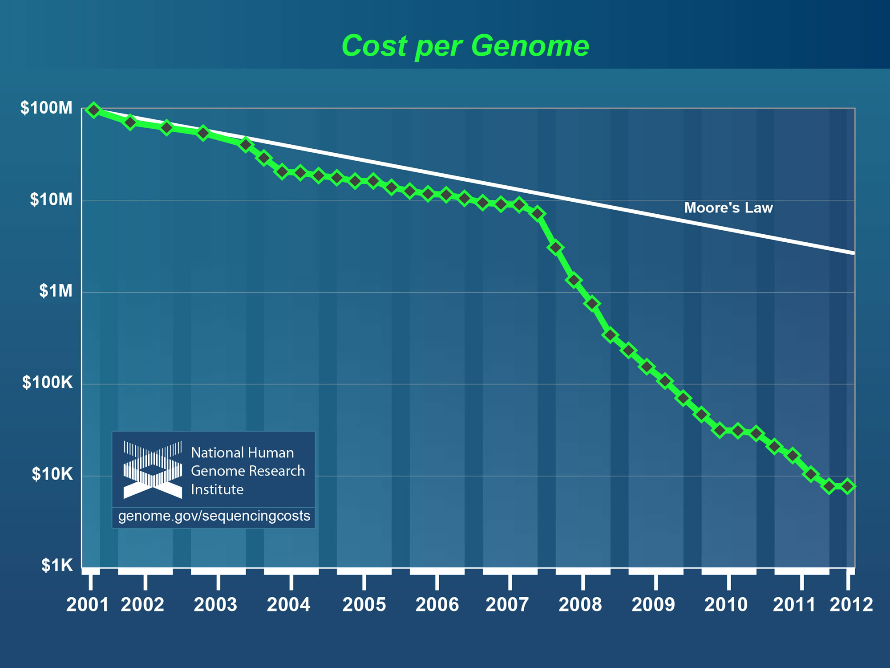
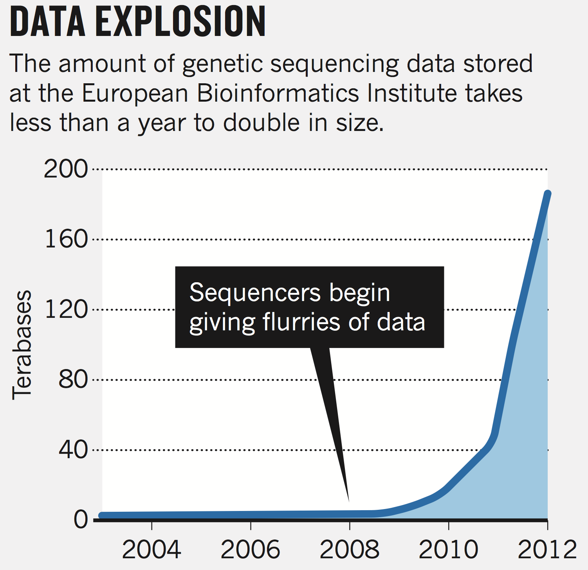
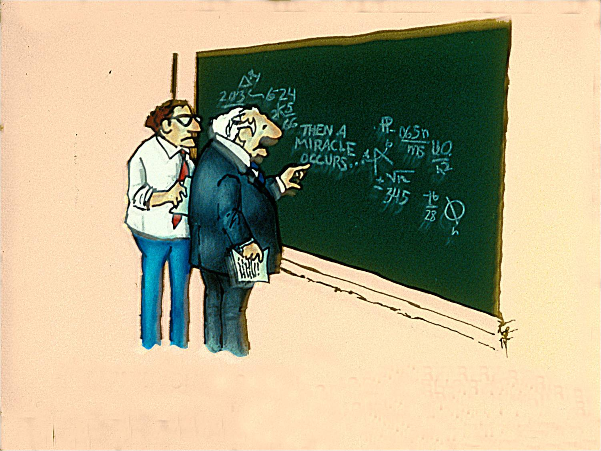
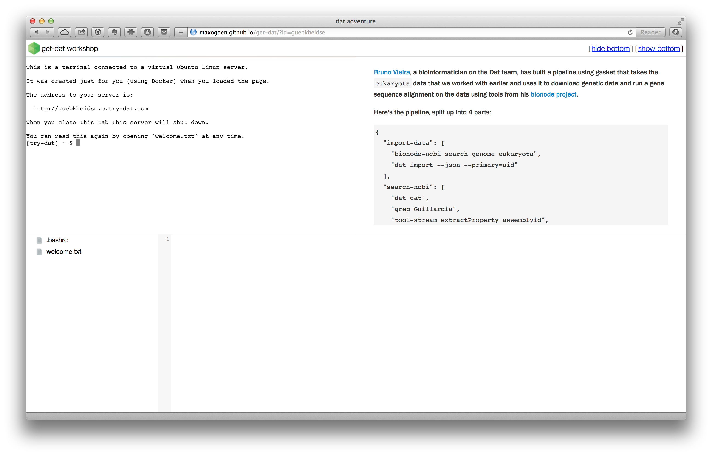
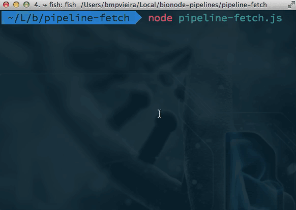
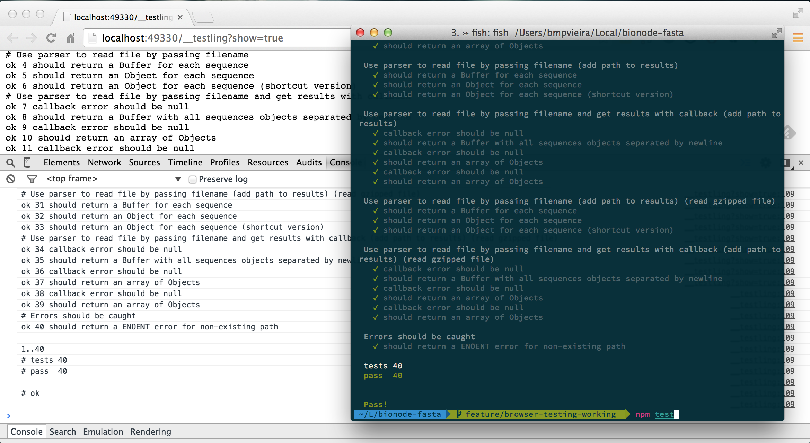
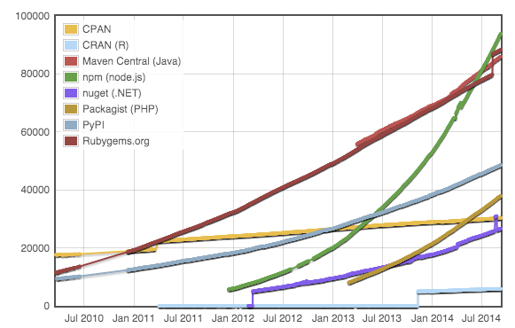
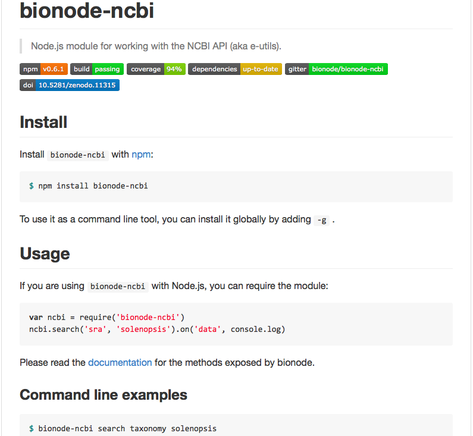
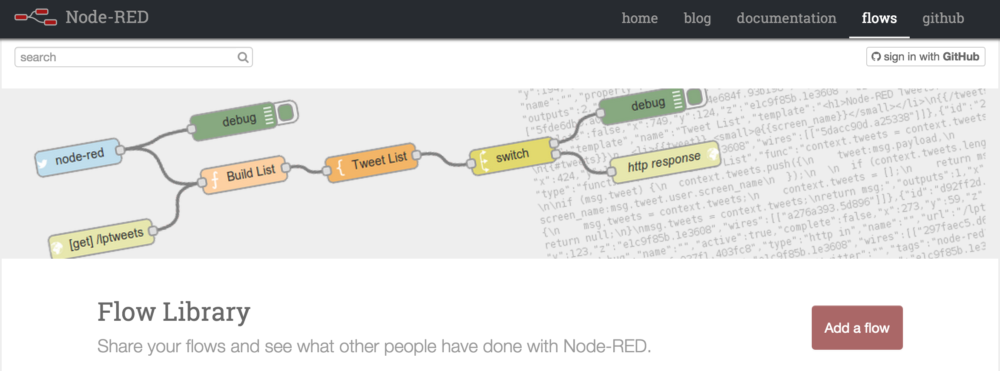
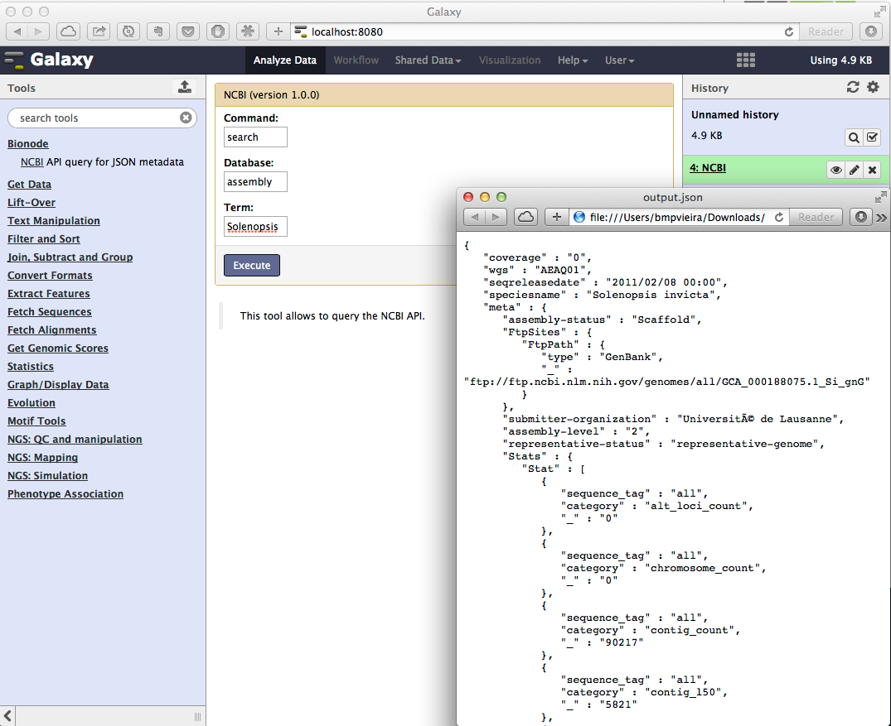

## Bionode intro

<a href="//bmpvieira.com/allbio14" target="_blank">bmpvieira.com/wurmlab-meeting15a</a>

 

---

### Bionode

**[Bionode.io](http://bionode.io)**  - *Modular and universal bioinformatics*

Pipeable UNIX command line tools and JavaScript / Node.js APIs for bioinformatic analysis workflows on the server and browser.
<a class="fragment" href="http://irccloud.com/#!/ircs://irc.freenode.net:6697/%23bionode">#bionode</a>
 
<a class="fragment" href="http://gitter.im/bionode/bionode">gitter.im/bionode/bionode</a>

---

### Problem: Too much data

---

### Reproducibility crisis

---

### Reproducibility layers

 
Code

 
Data

 

 
Workflow

 
Environment

---

<small>
<a href="https://github.com/bionode/bionode/issues/9">Bionode also collaborates with BioJS</a>
</small>

---

### Bionode - list of modules

| Name                   | Type           | Status          | People                                              |
|------------------------|----------------|-----------------------------|-----------------------------------------------------------------------|
| [ncbi]                 | Data access    | ![production][production]   |  [![bmpvieira][bmpvieira-img]][bmpvieira-url] [![maxogden][maxogden-img]][maxogden-url] [![mafintosh][mafintosh-img]][mafintosh-url] [![olgabot][olgabot-img]][olgabot-url] [![mlovci][mlovci-img]][mlovci-url] |
| [fasta]                | Parser         | ![request][production]      |  [![bmpvieira][bmpvieira-img]][bmpvieira-url]                         |
| [seq]                  | Wrangling      | ![request][production]      |  [![bmpvieira][bmpvieira-img]][bmpvieira-url] [IM][IsmailM-url] [![yeban][yeban-img]][yeban-url] |
| [ensembl]              | Data access    | ![request][production]         |  [![nerdstrike][nerdstrike-img]][nerdstrike-url] [![emepyc][emepyc-img]][emepyc-url] [![daviddao][daviddao-img]][daviddao-url] |
| [blast-parser]         | Parser         | ![request][production]         |  [![greenify][greenify-img]][greenify-url]                         |

---

### Bionode - list of modules

| Name                   | Type           | Status          | People                                              |
|------------------------|----------------|-----------------------------|-----------------------------------------------------------------------|
| [template]             | Documentation  | ![request][production]      |  [![bmpvieira][bmpvieira-img]][bmpvieira-url]                         |
| [JS pipeline]          | Documentation  | ![request][production]      |  [![bmpvieira][bmpvieira-img]][bmpvieira-url]                         |
| [Gasket pipeline]      | Documentation  | ![request][production]      |  [![bmpvieira][bmpvieira-img]][bmpvieira-url]                         |
| [Dat/Bionode workshop] | Documentation  | ![request][production]      |  [![bmpvieira][bmpvieira-img]][bmpvieira-url]                         |

---

### Bionode - list of modules

| Name                   | Type           | Status          | People                                              |
|------------------------|----------------|-----------------------------|-----------------------------------------------------------------------|
| [sra]                  | Wrappers       | ![development][development] |  [![bmpvieira][bmpvieira-img]][bmpvieira-url] [![olgabot][olgabot-img]][olgabot-url] [![mlovci][mlovci-img]][mlovci-url] |
| [bwa]                  | Wrappers       | ![development][development] |  [![bmpvieira][bmpvieira-img]][bmpvieira-url]                         |
| [sam]                  | Wrappers       | ![development][development] |  [![bmpvieira][bmpvieira-img]][bmpvieira-url] [![ekg][ekg-img]][ekg-url] |
| [bbi]                  | Parser         | ![development][development] |  [![bmpvieira][bmpvieira-img]][bmpvieira-url] [![dasmoth][dasmoth-img]][dasmoth-url] |

---

### Bionode - list of modules

![request][request]

| Name                   | Type            | People                                              |
|------------------------|---------------------|-----------------------------------------------------------------------|
| [ebi]                  | Data access         |  [![bmpvieira][bmpvieira-img]][bmpvieira-url] [![olgabot][olgabot-img]][olgabot-url] [![mlovci][mlovci-img]][mlovci-url] [![arq5x][arq5x-img]][arq5x-url] |
| [semantic]             | Data access         |  [![bmpvieira][bmpvieira-img]][bmpvieira-url] [![ktym][ktym-img]][ktym-url] |
| [vcf]                  | Parser              |  [![bmpvieira][bmpvieira-img]][bmpvieira-url]                         |
| [gff]                  | Parser              |  [![bmpvieira][bmpvieira-img]][bmpvieira-url]                         |
| [bowtie]               | Wrappers            |  [![bmpvieira][bmpvieira-img]][bmpvieira-url]                         |
| [sge]                  | Wrappers            |  [![bmpvieira][bmpvieira-img]][bmpvieira-url] [![maxogden][maxogden-img]][maxogden-url] [![ekg][ekg-img]][ekg-url] [![gawbul][gawbul-img]][gawbul-url] [![mkuzak][mkuzak-img]][mkuzak-url] [badryan][badryan-url] |
| [blast]                | Wrappers            |  [![bmpvieira][bmpvieira-img]][bmpvieira-url]                         |

---

### Bionode - list of modules

| Name                   | Type            | People                                              |
|------------------------|---------------------|-----------------------------------------------------------------------|
| [vsearch]              | Wrappers            |  [![bmpvieira][bmpvieira-img]][bmpvieira-url]                         |
| [khmer]                | Wrappers            |  [![bmpvieira][bmpvieira-img]][bmpvieira-url]                         |
| [rsem]                 | Wrappers            |  [![olgabot][olgabot-img]][olgabot-url]                               |
| [gmap]                 | Wrappers            |  [![olgabot][olgabot-img]][olgabot-url]                               |
| [star]                 | Wrappers            |  [![olgabot][olgabot-img]][olgabot-url]                               |
| [go]                   | Wrappers            |  [badryan][badryan-url]                               |

[ncbi]: https://github.com/bionode/bionode-ncbi
[NCBI API (e-utils)]: http://www.ncbi.nlm.nih.gov/books/NBK25501/
[fasta]: https://github.com/bionode/bionode-fasta
[seq]: https://github.com/bionode/bionode-seq
[template]: https://github.com/bionode/bionode-template
[JS pipeline]: https://github.com/bionode/bionode-examples
[Gasket pipeline]: https://github.com/bionode/bionode-example-dat-gasket
[Dat/Bionode workshop]: http://maxogden.github.io/get-dat
[Mozfest 2014]: http://schedule.mozillafestival.org/#session/-1I0CKguyr
[Gasket]: https://github.com/datproject/gasket
[sra]: https://github.com/bionode/bionode-sra
[SRA Toolkit]: http://www.ncbi.nlm.nih.gov/Traces/sra/sra.cgi?view=toolkit_doc
[bwa]: https://github.com/bionode/bionode-bwa
[Burrows-Wheeler Aligner]: http://bio-bwa.sourceforge.net
[sam]: https://github.com/bionode/bionode-sam
[Sequence Alignment/Map tools]: http://www.htslib.org
[bbi]: https://github.com/bionode/bionode-bbi
[BBI (bigWig and bigBed)]: http://genome.ucsc.edu/FAQ/FAQformat.html
[ebi]: https://github.com/bionode/bionode-ebi
[EBI API]: http://www.ebi.ac.uk/Tools/webservices/
[ensembl]: https://github.com/daviddao/biojs-rest-ensembl
[ENSEMBL API]: http://rest.ensembl.org
[semantic]: https://github.com/bionode/bionode-semantic
[vcf]: https://github.com/bionode/bionode-vcf
[Variant Call Format]: http://samtools.github.io/hts-specs/VCFv4.2.pdf
[gff]: https://github.com/bionode/bionode-gff
[General Feature Format]: https://www.sanger.ac.uk/resources/software/gff/spec.html
[bowtie]: https://github.com/bionode/bionode-bowtie
[Bowtie aligner]: http://bowtie-bio.sourceforge.net/index.shtml
[sge]: https://github.com/bionode/bionode-sge
[SUN Grid Engine]: https://arc.liv.ac.uk/trac/SGE
[blast]: https://github.com/bionode/bionode-blast
[blast-parser]: https://github.com/greenify/biojs-io-blast
[Basic Local Alignment Search Tool]: http://www.ncbi.nlm.nih.gov/books/NBK1763/
[vsearch]: https://github.com/bionode/bionode-vsearch
[Search and clustering]: https://github.com/torognes/vsearch
[khmer]: https://github.com/bionode/bionode-khmer
[k-mer counting & filtering]: http://khmer.readthedocs.org/en/v1.1/
[rsem]: https://github.com/bionode/bionode-rsem
[RNA-Seq by Expectation-Maximization]: https://github.com/bli25wisc/RSEM
[gmap]: https://github.com/bionode/bionode-gmap
[Genomic Mapping and Alignment Program]: http://research-pub.gene.com/gmap/
[star]: https://github.com/bionode/bionode-star
[Spliced Transcripts Alignment to a Reference]: https://github.com/alexdobin/STAR
[go]: https://github.com/bionode/bionode-go
[Gene ontology]: http://en.wikipedia.org/wiki/Gene_ontology

[production]:https://img.shields.io/badge/status-production-green.svg?style=flat-square
[development]:https://img.shields.io/badge/status-development-orange.svg?style=flat-square
[request]:https://img.shields.io/badge/status-request-blue.svg?style=flat-square

[bmpvieira-img]: https://avatars3.githubusercontent.com/u/263386?v=3&s=40
[bmpvieira-url]: https://github.com/bmpvieira
[maxogden-img]: https://avatars3.githubusercontent.com/u/39759?v=3&s=40
[maxogden-url]: https://github.com/maxogden
[mafintosh-img]: https://avatars3.githubusercontent.com/u/376661?v=3&s=40
[mafintosh-url]: https://github.com/mafintosh
[olgabot-img]: https://avatars3.githubusercontent.com/u/806256?v=3&s=40
[olgabot-url]: https://github.com/olgabot
[mlovci-img]: https://avatars3.githubusercontent.com/u/909047?v=3&s=40
[mlovci-url]: https://github.com/mlovci
[arq5x-img]: https://avatars3.githubusercontent.com/u/72291?v=3&s=40
[arq5x-url]: https://github.com/arq5x
[ktym-img]: https://pbs.twimg.com/profile_images/1124266319/ktym_normal.jpg
[ktym-url]: https://github.com/ktym
[ekg-img]: https://avatars3.githubusercontent.com/u/145425?v=3&s=40
[ekg-url]: https://github.com/ekg
[badryan-img]: https://avatars3.githubusercontent.com/u/6317446?v=3&s=40
[badryan-url]: https://github.com/badryan
[gawbul-img]: https://avatars3.githubusercontent.com/u/321291?v=3&s=40
[gawbul-url]: https://github.com/gawbul
[mkuzak-img]: https://avatars3.githubusercontent.com/u/208443?v=3&s=40
[mkuzak-url]: https://github.com/mkuzak
[dasmoth-img]: https://avatars3.githubusercontent.com/u/209047?v=3&s=40
[dasmoth-url]: https://github.com/dasmoth
[IsmailM-img]: https://avatars3.githubusercontent.com/u/5578375?v=3&s=40
[IsmailM-url]: https://github.com/IsmailM
[yeban-img]: https://avatars3.githubusercontent.com/u/90373?v=3&s=40
[yeban-url]: https://github.com/yeban
[nerdstrike-img]: https://avatars3.githubusercontent.com/u/5434501?v=3&s=40
[nerdstrike-url]: https://github.com/nerdstrike
[emepyc-img]: https://avatars3.githubusercontent.com/u/473962?v=3&s=40
[emepyc-url]: https://github.com/emepyc
[daviddao-img]: https://avatars0.githubusercontent.com/u/1241240?v=3&s=40
[daviddao-url]: https://github.com/daviddao
[greenify-img]: https://avatars1.githubusercontent.com/u/4370550?v=3&s=40
[greenify-url]: https://github.com/greenify

---

### Dat workshop

[maxogden.github.io/get-dat](http://maxogden.github.io/get-dat)

---

### Bionode

<code class="fragment">npm install -g bionode</code> 
<code class="fragment">bionode ncbi download gff bacteria</code>
<code class="fragment">bionode ncbi download sra arthropoda | bionode sra fastq-dump</code> 
<code class="fragment">npm install -g bionode-ncbi</code> 
<code class="fragment">bionode-ncbi search assembly formicidae | dat import --json</code> 

---

### Some problems I faced during my research:

<ul>
<li class="fragment">For web projects, needed to implement the same functionality on browser and server</li>

<li class="fragment"> Difficulty getting relevant descriptions and datasets from NCBI API using bio\* libs</li>

<li class="fragment">Difficulty writing scalable, reproducible and complex bioinformatic pipelines</li>
</ul>

---

** Need to reimplement the same code on browser and server. **

Solution: JavaScript everywhere

* [Afra](http://afra.sbcs.qmul.ac.uk) -> [bionode-seq]() 
* [GeneValidator](http://genevalidator.sbcs.qmul.ac.uk) -> [seq](https://github.com/bionode/bionode-seq), [fasta](https://github.com/bionode/bionode-fasta)
* [SequenceServer](http://www.sequenceserver.com)
* [BioJS](http://biojs.net)  -> [collaborating for code reuse](http://github.com/bionode/bionode/issues/9)
* [Biodalliance](http://www.biodalliance.org) -> [converting to bionode](https://github.com/bionode/bionode-bbi)

---

** Difficulty getting relevant description and datasets from NCBI API using bio* libs **

<strong>Python example:</strong> URL for the Achromyrmex assembly?

<a href="ftp://ftp.ncbi.nlm.nih.gov/genomes/all/GCA_000188075.1_Si_gnG"><pre>ftp://ftp.ncbi.nlm.nih.gov/genomes/all/GCA_000188075.1_Si_gnG</pre></a>

<pre class="fragment">
import xml.etree.ElementTree as ET
from Bio import Entrez
Entrez.email = "mail@bmpvieira.com"
esearch_handle = Entrez.esearch(db="assembly", term="Achromyrmex")
esearch_record = Entrez.read(esearch_handle)
for id in esearch_record['IdList']:
  esummary_handle = Entrez.esummary(db="assembly", id=id)
  esummary_record = Entrez.read(esummary_handle)
  documentSummarySet = esummary_record['DocumentSummarySet']
  document = documentSummarySet['DocumentSummary'][0]
  metadata_XML = document['Meta'].encode('utf-8')
  metadata = ET.fromstring('<root>' + metadata_XML + '</root>')
  for entry in Metadata[1]:
    print entry.text
</pre>

Solution: <a href="http://github.com/bionode/bionode-ncbi">bionode-ncbi</a>

---

** Difficulty getting relevant description and datasets from NCBI API using bio* libs **

<strong>Example:</strong> URL for the Achromyrmex assembly?

<a href="http://ftp.ncbi.nlm.nih.gov/genomes/all/GCA_000204515.1_Aech_3.9/GCA_000204515.1_Aech_3.9_genomic.fna.gz"><pre>http://ftp.ncbi.nlm.nih.gov/genomes/all/GCA_000204515.1_Aech_3.9/GCA_000204515.1_Aech_3.9_genomic.fna.gz</pre></a>

JavaScript

<pre class="fragment">
var bio = require('bionode')
bio.ncbi.urls('assembly', 'Acromyrmex', function(urls) {
  console.log(urls[0].genomic.fna)
})
</pre>

<pre class="fragment">
bio.ncbi.urls('assembly', 'Acromyrmex').on('data', printGenomeURL)
function printGenomeURL(urls) {
  console.log(urls[0].genomic.fna)
})
</pre>

---

** Difficulty getting relevant description and datasets from NCBI API using bio* libs **

<strong>Example:</strong> URL for the Achromyrmex assembly?

<a href="http://ftp.ncbi.nlm.nih.gov/genomes/all/GCA_000204515.1_Aech_3.9/GCA_000204515.1_Aech_3.9_genomic.fna.gz"><pre>http://ftp.ncbi.nlm.nih.gov/genomes/all/GCA_000204515.1_Aech_3.9/GCA_000204515.1_Aech_3.9_genomic.fna.gz</pre></a>

JavaScript

<pre class="fragment">
var ncbi = require('bionode-ncbi')
var ndjson = require('ndjson')
ncbi.urls('assembly', 'Acromyrmex')
.pipe(ndjson.stringify())
.pipe(process.stdout)
</pre>

BASH

<pre class="fragment">
bionode-ncbi urls assembly Acromyrmex |
tool-stream extractProperty genomic.fna

</pre>

---

**Difficulty writing scalable, reproducible and complex bioinformatic pipelines.**

Solution: Node.js Streams everywhere

<pre>
var ncbi = require('bionode-ncbi')
var tool = require('tool-stream')
var through = require('through2')
var fork1 = through.obj()
var fork2 = through.obj()
</pre>

---

**Difficulty writing scalable, reproducible and complex bioinformatic pipelines.**

Solution: Node.js Streams everywhere

<pre>
ncbi
.search('sra', 'Solenopsis invicta')
.pipe(fork1)
.pipe(dat.reads)

fork1
.pipe(tool.extractProperty('expxml.Biosample.id'))
.pipe(ncbi.search('biosample'))
.pipe(dat.samples)

fork1
.pipe(tool.extractProperty('uid'))
.pipe(ncbi.link('sra', 'pubmed'))
.pipe(ncbi.search('pubmed'))
.pipe(fork2)
.pipe(dat.papers)
</pre>

---

---

**Difficulty writing scalable, reproducible and complex bioinformatic pipelines.**

<pre>
bionode-ncbi search genome Guillardia theta |
tool-stream extractProperty assemblyid |
bionode-ncbi download assembly |
tool-stream collectMatch status completed |
tool-stream extractProperty uid|
bionode-ncbi link assembly bioproject |
tool-stream extractProperty destUID |
bionode-ncbi link bioproject sra |
tool-stream extractProperty destUID |
bionode-ncbi download sra |
bionode-sra fastq-dump |
tool-stream extractProperty destFile |
bionode-bwa mem 503988/GCA_000315625.1_Guith1_genomic.fna.gz |
tool-stream collectMatch status finished|
tool-stream extractProperty sam|
bionode-sam
</pre>

---

**Difficulty writing scalable, reproducible and complex bioinformatic pipelines.**

* [bionode-example-dat-gasket](https://github.com/bionode/bionode-example-dat-gasket)
* [get-dat workshop](http://maxogden.github.io/get-dat/)
* [get-dat bionode gasket example](https://github.com/maxogden/get-dat/blob/master/markdown/08-extra-credit.md)

---

**Difficulty writing scalable, reproducible and complex bioinformatic pipelines.**

<pre>
 { 
   "import-data": [ 
     "bionode-ncbi search genome eukaryota", 
     "dat import --json --primary=uid" 
   ], 
   "search-ncbi": [ 
     "dat cat", 
     "grep Guillardia", 
     "tool-stream extractProperty assemblyid", 
     "bionode-ncbi download assembly -", 
     "tool-stream collectMatch status completed", 
     "tool-stream extractProperty uid", 
     "bionode-ncbi link assembly bioproject -", 
     "tool-stream extractProperty destUID", 
     "bionode-ncbi link bioproject sra -", 
     "tool-stream extractProperty destUID", 
     "grep 35526", 
     "bionode-ncbi download sra -", 
     "tool-stream collectMatch status completed", 
     "tee > metadata.json" 
   ], 
</pre>

---

**Difficulty writing scalable, reproducible and complex bioinformatic pipelines.**

<pre>
   "index-and-align": [ 
     "cat metadata.json", 
     "bionode-sra fastq-dump -", 
     "tool-stream extractProperty destFile", 
     "bionode-bwa mem **/*fna.gz" 
   ], 
   "convert-to-bam": [ 
     "bionode-sam 35526/SRR070675.sam" 
   ] 
 } 

</pre>

---

**Difficulty writing scalable, reproducible and complex bioinformatic pipelines.**

[datscript](https://github.com/datproject/datscript)
<pre class="fragment">
pipeline main
run pipeline import

pipeline import
run foobar | run dat import --json
</pre>

[bmpvieira example](https://github.com/datproject/datscript/blob/master/example.ds)

[ekg example](https://github.com/ekg/datscriptish/blob/master/example.dsh)

---

## Extra slides

---

### Bionode - Why wrappers?

* Same interface between modules (Streams and NDJSON)
* Easy installation with NPM
* Semantic versioning
* Add tests
* Abstract complexity / More user friendly

---

### Bionode - Why Node.js?

Same code client/server side

---

### Bionode - Why Node.js?

---

### Reusable, small and tested modules

---

### Benefit from other JS projects

<a href="http://dat-data.com" target="_blank">Dat</a>

<a href="http://biojs.net" target="_blank">BioJS</a>

<a href="http://noflojs.org" target="_blank">NoFlo</a>

---

<section data-background="img/noflo.png"></section>

---

<section data-background="img/bionode-pipeline.png"></section>

---

---
